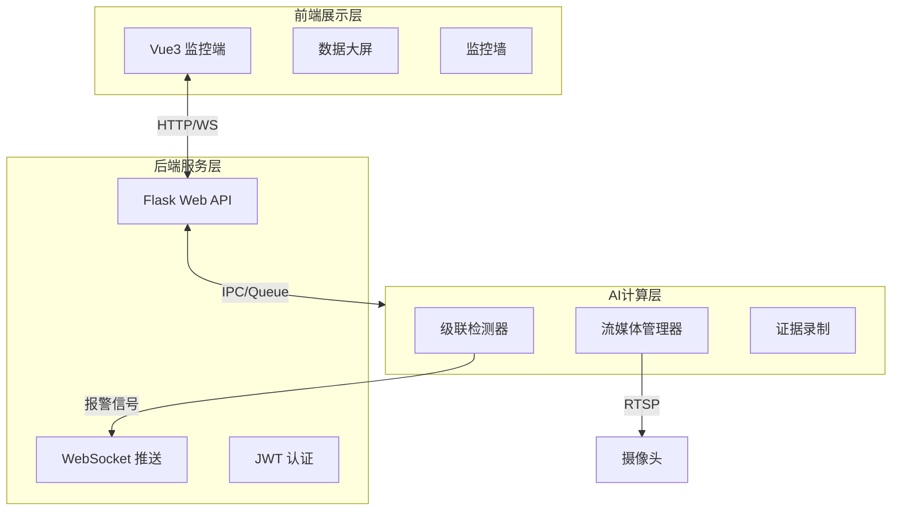

# 🎓 高校无烟校园智能监测系统 (Smart No-Smoking Campus System)

> 基于 AI 视觉分析的实时吸烟行为监测平台 | 秒级报警 | 证据回溯 | 工业级架构


## 📖 项目简介

高校无烟校园智能监测系统是一套高性能、高可用性的智能视频分析平台。系统利用先进的深度学习技术，对校园内的 RTSP 监控视频流进行实时分析，精准识别吸烟行为。

**核心突破**：针对传统方案中"小目标（远处烟头）难以识别"、"多路视频显存溢出"、"检测框闪烁"等痛点，本项目采用了 **级联 ROI 检测 (Cascade Detection)**、**Batch 批处理推理** 及 **FP16 半精度加速** 等工业级优化手段，在单张 RTX 3060 显卡上实现了多路高精度、低延迟（<300ms）的实时监测。

---

## 🛠 技术栈 (Tech Stack)

### 🧠 AI 核心与算法
- **深度学习框架**: PyTorch 2.0+ & CUDA 11.x
- **目标检测**: YOLOv8 (S/N模型)
- **推理加速**: **TensorRT / FP16 (半精度)**, **Batch Inference (批处理)**
- **计算机视觉**: OpenCV 4.x (多线程流处理)
- **架构模式**: **Singleton (全局单例显存管理)**, **Cascade ROI (级联检测)**

### 💻 后端服务
- **Web 框架**: Python Flask
- **实时通信**: Flask-SocketIO (WebSocket)
- **身份认证**: Flask-JWT-Extended
- **并行计算**: Python Multiprocessing & Threading
- **ORM**: SQLAlchemy

### 🎨 前端交互
- **框架**: Vue 3 (Composition API) + TypeScript
- **构建工具**: Vite
- **UI 组件**: Element Plus
- **状态管理**: Pinia
- **可视化**: ECharts

### 🗄️ 数据存储
- **结构化数据**: MySQL 8.0
- **非结构化数据**: 本地文件系统 (视频证据/快照)

---

## 🏗 系统架构 (Architecture)

### 1. 业务逻辑架构
系统采用标准的前后端分离设计，AI 计算层独立于 Web 服务层运行。



### 2. AI 推理管线 (核心创新)

采用 **"级联 ROI 检测 + 惯性追踪"** 架构，解决小目标检测难题。

```mermaid
graph TD
    A[RTSP 视频流输入] --> B{智能握手 Smart Handshake};
    B -- 失败 --> C[自动重试/休眠唤醒];
    B -- 成功 --> D[解码器 Buffer=1 (极低延迟)];
    
    D --> E[全局单例检测器 (Singleton)];
    
    subgraph AI推理管线 [GPU FP16加速]
        E --> F[Stage 1: 全局找人 (YOLOv8s)];
        F --> G[ROI筛选: 面积最大的TopN];
        G --> H[动态裁切: 上半身+Padding外扩];
        H --> I[Batch Tensor 打包];
        I --> J[Stage 2: 局部找烟 (YOLO-Smoke)];
    end
    
    J --> K[坐标还原 + 相对位置计算];
    K --> L{是否检测到?};
    L -- 是 --> M[更新记忆库 (Life=3)];
    L -- 否 --> N[调用惯性记忆补全];
    
    M --> O[输出最终检测框];
    N --> O;

```

---

## ⚡️ 核心算法与优化 (Core Features)

### 1. 级联 ROI 检测 (Cascade Region-of-Interest)

针对"远处烟头像素极小（<10px）、难以识别"的痛点，系统摒弃了传统的单阶段全图检测，采用**双阶段级联架构**：

* **Stage 1 全局定位**：使用轻量级 YOLOv8s 模型快速定位画面中的人员，并进行 ID 追踪（Tracking）。
* **Stage 2 局部精搜**：智能裁切人物上半身区域（ROI），并向外扩容 30% 以覆盖手部动作范围。将裁剪后的高清局部图送入专用烟头模型进行二次推理。
* **效果**：显著提升了对小目标的召回率，实现了"10米外烟头精准识别"。

### 2. Batch 批处理与 FP16 加速

针对多路视频流导致的显存溢出和高延迟问题：

* **Batch Inference**：将画面中多个人员的 ROI 区域打包成一个 Batch Tensor，一次性送入 GPU 计算，吞吐量提升 3-4 倍。
* **FP16 半精度**：利用 RTX 显卡 Tensor Core 进行半精度推理，在不损失精度的前提下，将物理延迟压缩至 **300ms 以内**。
* **全局单例**：实现检测器单例模式，无论开启多少路监控，显存中仅维护一份模型权重，彻底解决 OOM (Out of Memory) 问题。

### 3. 惯性追踪防闪烁 (Inertial Smoothing)

针对视频识别中常见的"检测框闪烁"问题：

* 引入**相对坐标记忆库**，记录烟头相对于人体骨架的位置。
* 当出现运动模糊导致偶尔漏检时，利用惯性逻辑进行**视觉暂留补全**（Debouncing），确保报警框像"磁铁"一样平滑地吸附在目标手上。

### 4. 智能网络/资源管理

* **智能握手**：针对移动端/低功耗摄像头，设计了 **"UDP唤醒 -> 重试 -> TCP保底"** 的连接策略。
* **僵尸线程查杀**：基于锁机制的资源释放策略，确保删除设备后立即物理断开连接，防止后台资源泄露。

---

## 📂 项目结构

```
Smart No-Smoking Campus System/
├── report/                     # 项目文档
├── web-flask/                  # 后端工程
│   ├── app/
│   │   ├── api/                # RESTful API
│   │   ├── core/               # AI 核心算法
│   │   │   ├── detector.py     # YOLO 级联检测器 (单例/Batch/FP16)
│   │   │   ├── stream_loader.py# 视频流管理 (防僵尸线程)
│   │   │   └── best.pt         # 训练好的模型权重
│   │   ├── models/             # 数据库模型
│   │   └── sockets/            # WebSocket 事件
│   ├── run.py                  # 启动入口
│   └── config.py               # 配置
└── web-vue/                    # 前端工程
    ├── src/
    │   ├── api/                # Axios 请求封装
    │   ├── views/              # Vue 页面 (Monitor/DeviceManage)
    │   └── stores/             # Pinia 状态管理

```

---

## 🚀 快速开始 (Quick Start)

### 后端部署 (Flask + AI)

1. **环境准备**: Python 3.9+, CUDA 11+ (推荐)
2. **安装依赖**:
```bash
cd web-flask
pip install -r requirements.txt

```


*(注意: `torch` 和 `ultralytics` 需根据你的 GPU 版本选择合适的安装命令)*
3. **配置数据库**: 修改 `config.py` 中的 MySQL 连接信息。
4. **启动服务**:
```bash
python run.py

```


*服务将运行在 `http://0.0.0.0:5000*`

### 前端部署 (Vue3)

1. **环境准备**: Node.js 16+
2. **安装依赖**:
```bash
cd web-vue
npm install

```


3. **启动开发环境**:
```bash
npm run dev

```


---

## 📅 更新日志 (Changelog)

### v3.3 (2026-01-16) [最新]

* **架构重构**：引入级联检测（Cascade Detection）架构，大幅提升小目标识别率。
* **性能飞跃**：实现 Batch 推理与 FP16 半精度加速，多路并发显存占用降低 60%，延迟 <300ms。
* **稳定性升级**：
* 修复了删除设备后后台"僵尸线程"占用的问题。
* 优化 RTSP 连接策略，增加断流自动熔断与智能唤醒机制。
* 实现全局单例模型加载，彻底解决显存溢出崩溃问题。


* **体验优化**：新增惯性追踪算法，消除检测框闪烁现象。

### v3.2 (2026-01-14)

* **用户权限**：完善 JWT 认证与多级权限控制。
* **API 扩展**：分离设备管理与监控逻辑。

### v3.1 (2026-01-10)

* **算法迁移**：全面迁移至 YOLOv8，弃用旧版 Pose 方案，提升抗遮挡能力。

---

## 📄 许可证

本项目采用 MIT 许可证。详见 LICENSE 文件。
