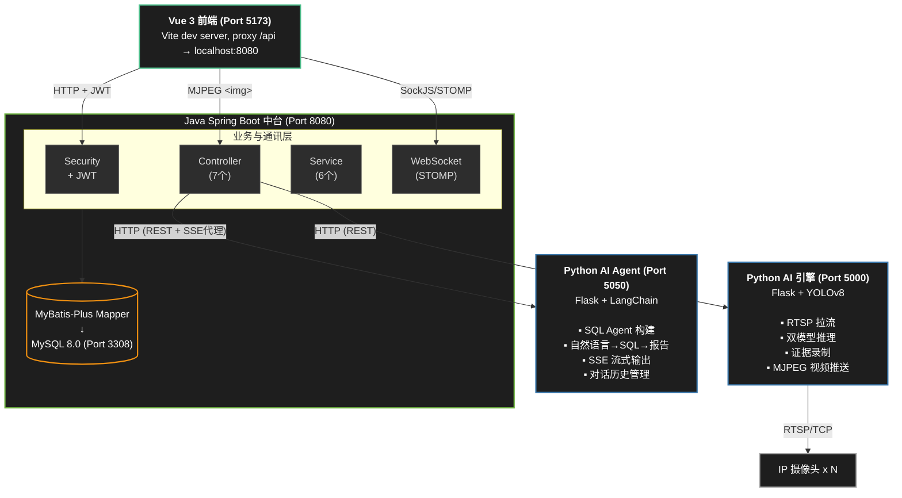
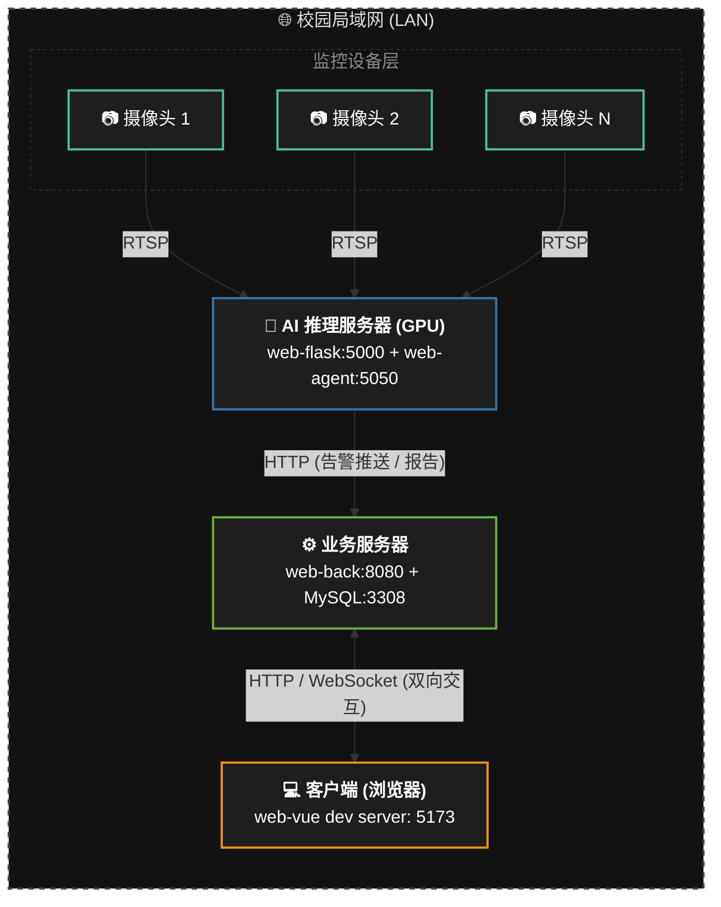

# 智慧校园禁烟监控系统 — 概要设计说明书 (HLD)

| 项目名称 | 智慧校园禁烟监控系统 (Smart No-Smoking Campus System) |
| --- | --- |
| **文档编号** | HLD-2026-NSCS-V3.0 |
| **版本号** | V 3.0（四服务架构版） |
| **设计日期** | 2026-05-08 |
| **密级** | 内部公开 |

---

## 1. 引言

### 1.1 设计目标

设计一个高内聚、低耦合、职责清晰的分布式监控系统。核心目标：

- **关注点分离：** AI 推理、业务逻辑、数据分析、前端展示四个独立服务
- **实时性：** 报警延迟控制在秒级（检测→WebSocket→前端弹窗）
- **可扩展：** 新增摄像头仅需数据库注册，无需修改代码
- **安全性：** 分层鉴权 + 最小权限 + 物理隔离

### 1.2 设计原则

- **单一职责：** 每个服务只做一件事（Python 不写业务逻辑，Java 不做 AI 推理）
- **接口标准化：** 统一 `{ code, msg, data }` 响应格式
- **故障隔离：** 一个服务宕机不影响其他服务核心功能
- **优先开源生态：** 充分复用 YOLO、LangChain、Spring Boot、Element Plus 等成熟框架
- **防御性编程：** 占位符保护（`<<sp>>`/`<<br>>`）防网络层裁切、Buffer 缓冲防 TCP 粘包

---

## 2. 系统总体架构

### 2.1 四服务协同架构



### 2.2 服务通信矩阵

| 调用方 | 被调方 | 协议 | 认证方式 | 典型场景 |
| --- | --- | --- | --- | --- |
| web-vue | web-back | HTTP REST | JWT Bearer Token | 所有业务 API |
| web-vue | web-back | WebSocket (SockJS/STOMP) | 无（connect 时免认证） | 报警实时推送 |
| web-vue | web-flask | HTTP (MJPEG) | 无 | `` 标签展示视频流 |
| web-back | web-agent | HTTP REST | 无（内网直连） | 同步问答 / SSE 流代理 |
| web-flask | web-back | HTTP REST | 无（白名单路径） | 报警上报、设备状态同步、设备列表拉取 |
| web-agent | MySQL | TCP | 只读账号 `ai_reader` | SQL 查询视图 |

### 2.3 物理部署拓扑



---

## 3. 模块划分

### 3.1 模块总览

| 模块 | 工程目录 | 端口 | 技术栈 | 核心职责 |
| --- | --- | --- | --- | --- |
| 前端大屏 | `web-vue/` | 5173 | Vue 3 + TS + Element Plus + Pinia + ECharts | 用户交互、状态管理、图表渲染 |
| 业务中台 | `web-back/` | 8080 | Spring Boot 3 + MyBatis-Plus + WebSocket | 鉴权、CRUD、报警推送、SSE 代理 |
| AI 视觉引擎 | `web-flask/` | 5000 | Flask + YOLOv8 + OpenCV + PyTorch | RTSP 拉流、吸烟检测、证据录制 |
| AI 分析助手 | `web-agent/` | 5050 | Flask + LangChain + SQLDatabaseToolkit | NL→SQL、流式问答、对话记忆 |

### 3.2 前端模块（web-vue）

7 个路由页面、5 个 API 模块、1 个 Pinia Store：

| 页面 | 路由 | 权限 | 功能 |
| --- | --- | --- | --- |
| Login | `/login` | 公开 | 登录 |
| Monitor | `/` | 已登录 | 主监控大屏 + AI 对话抽屉 |
| AuditConsole | `/audit` | 已登录 | 报警仲裁台 |
| AlarmArchive | `/archive` | 已登录 | 历史档案 |
| SystemControl | `/system` | admin | 系统控制台 |
| DeviceManage | `/devices` | admin | 设备管理 |
| UserManage | `/users` | admin | 用户管理 |

### 3.3 业务中台模块（web-back）

**控制器层（7 个 Controller）：**

| 控制器 | 路径前缀 | 核心接口 |
| --- | --- | --- |
| AuthController | `/api/auth` | login, logout, me |
| AlarmController | `/api/alerts` | pending, audit, archive, delete, report |
| DeviceController | `/api/monitor/devices` + `/api/internal/devices` | CRUD, status-only, sync-status |
| AiChatController | `/api/ai/conversations` | 会话管理, chat, chat/stream, messages |
| SystemController | `/api/system` | status, control/global_ai_db |
| InternalController | `/api/internal` | alarm/report (Python→Java→WebSocket) |
| UserController | `/api/user` | CRUD |

**服务层（6 个 Service）：** AuthService, AlarmService, DeviceService, AiChatServiceImpl, UserService, SystemMonitorService

### 3.4 AI 视觉引擎模块（web-flask）

| 组件 | 文件 | 职责 |
| --- | --- | --- |
| StreamManager (单例) | `stream_loader.py` | 全局设备管理、全局 AI 开关 |
| StreamLoader | `stream_loader.py` | 单路摄像头：拉流/推理/录像 三线程模型 |
| SmokingDetector (单例) | `detector.py` | 双模型加载、级联推理、碰对/惯性追踪 |
| EvidenceRecorder | `recorder.py` | 环形缓冲、录像合成、FFmpeg 转码 |
| monitor_bp | `api/monitor.py` | MJPEG 流推送、设备同步、点火保护 |
| system_bp | `api/system.py` | 全局 AI 开关控制 |

### 3.5 AI 分析助手模块（web-agent）

| 组件 | 文件 | 职责 |
| --- | --- | --- |
| Flask App | `app.py` | HTTP 入口、SSE 流式 + 同步两个接口 |
| AgentService | `agent_service.py` | Agent 构建（双重检查锁单例）、流式推理、历史注入 |
| Settings | `config.py` | 环境变量配置（frozen dataclass） |
| System Prompt | `prompt.py` | SQL Agent 指令（注入 Schema、安全约束、输出规范） |
| DB Toolkit | `db_toolkit.py` | SQLDatabase 连接初始化 |

---

## 4. 核心流程设计

### 4.1 吸烟检测→报警→审核 完整链路

```
摄像头 RTSP 流
    │
    ▼
StreamLoader._reader_thread  持续拉流 → latest_frame
    │
    ▼
StreamLoader._processor_thread  取帧 → 推理 → 报警判定
    │
    ├── 非报警帧：画框 → recorder.add_frame() → output_frame
    │
    └── 报警帧：
         │
         ├── 保存快照 (JPG, 带框)
         ├── 启动录像 (2s 预录 + 5s 后录 → FFmpeg H.264)
         ├── HTTP POST → Java InternalController.alarm/report
         │       │
         │       ├── 写入 alarms 表 (audit_status=0)
         │       ├── 查询设备名
         │       └── WebSocket → /topic/alarm → 前端弹窗
         │
         └── 录像结束后自动闭合文件
```

### 4.2 AI 数据分析链路

```
用户在 AiChat.vue 输入 "最近一周报警趋势"
    │
    ▼
Vue fetch() → Java AiChatController.chat/stream (SSE)
    │
    ▼
Java WebClient 透传 → Python web-agent /api/agent/chat/stream
    │
    ▼
AgentService.ask_stream()
    ├── 从 SQLChatMessageHistory 读取最近 3 轮对话
    ├── 拼装 enriched_input（历史 + 当前问题）
    ├── LangChain astream_events 异步流式推理
    │       ├── Agent 生成 SQL  → sql_db_query 工具
    │       ├── MySQL ai_reader 账号执行（仅视图）
    │       └── LLM 综合结果 → 中文分析报告
    └── 手动写入 ai_chat_history (add_user_message + add_ai_message)
    │
    ▼
SSE 流返回 → Java → Vue fetch ReadableStream 逐 chunk 渲染 Markdown
```

### 4.3 设备状态同步链路

```
系统启动 / Java 设备变更:
    Java DeviceService.updateDevice()
        → CompletableFuture 异步通知 Python /api/v1/monitor/sync
        → Python monitor._do_sync()
            → GET /api/internal/devices (白名单)
            → 解析设备列表，更新 device_config_cache
            → StreamManager.update_active_streams()
                → 新设备: add_camera() → StreamLoader.start() (三线程)
                → 移除设备: loader.stop() → del

运行时状态上报:
    StreamLoader._reader_thread
        → 连接成功: _update_db_status(1)
        → 连接失败: _update_db_status(0)
        → HTTP POST → Java /api/monitor/devices/sync-status
```

---

## 5. 数据库设计

### 5.1 实体关系

```
users (1) ──< ai_conversations (N)
users (1) ──< alarms (auditor_id) (N)
devices (1) ──< alarms (camera_id) (N)
ai_conversations (1) ──< ai_chat_history (N)  [by session_id]
```

### 5.2 核心表结构

**alarms（报警记录表）**

| 字段 | 类型 | 说明 |
| --- | --- | --- |
| id | BIGINT PK | 自增主键 |
| camera_id | INT FK | 关联 devices.id |
| type | ENUM('SMOKING','FIRE') | 报警类型 |
| confidence | FLOAT | 置信度 |
| created_at | DATETIME | 报警时间 |
| video_url | VARCHAR(255) | 证据视频路径 |
| roi_url | VARCHAR(255) | 特写图路径 |
| audit_status | TINYINT | 0-待审核, 1-已确认, 2-误报, 9-已忽略 |
| auditor_id | INT FK (nullable) | 审核人 ID |
| audit_time | DATETIME (nullable) | 审核时间 |
| audit_remark | VARCHAR(255) (nullable) | 审核备注 |

**devices（设备表）**

| 字段 | 类型 | 说明 |
| --- | --- | --- |
| id | INT PK | 自增主键 |
| name | VARCHAR(100) | 设备名称 |
| rtsp_url | VARCHAR(500) | RTSP 流地址 |
| area_config | JSON (nullable) | ROI 区域配置 |
| status | INT | 1-在线, 0-离线 |
| enabled | TINYINT(1) | 1-启用, 0-停用 |

**users（用户表）**

| 字段 | 类型 | 说明 |
| --- | --- | --- |
| id | INT PK | 自增主键 |
| username | VARCHAR(50) UNIQUE | 登录账号 |
| password | VARCHAR(255) | Bcrypt 密文 |
| role | VARCHAR(20) | 'admin' / 'user' |
| status | TINYINT | 1-启用, 0-禁用 |
| last_login_ip | VARCHAR(50) | 最后登录 IP |
| last_login_time | DATETIME | 最后登录时间 |

### 5.3 AI 视图设计

4 个视图将 alarms / devices / users 三表 JOIN 并预计算聚合指标，为 AI Agent 提供语义层。视图使用 `SQL SECURITY DEFINER` 创建，AI Agent 的 `ai_reader` 账号仅需 `SELECT` + `SHOW VIEW` 权限。

---

## 6. 安全设计

### 6.1 认证与授权

```
前端请求
    │
    ▼
Spring Security (全部放行，仅做 CORS)
    │
    ▼
JwtInterceptor (拦截 /api/**)
    ├── 白名单路径直接放行:
    │     /api/auth/login, /api/internal/**, /api/monitor/devices/sync-status
    │     /api/alerts/report, /api/monitor/stream/**
    ├── 验证 Authorization: Bearer <token>
    │     ├── 有效: 解析 uid → request.setAttribute("uid", uid) → 放行
    │     └── 无效: 401 JSON 响应
    │
    ▼
前端路由守卫 (router.beforeEach)
    ├── 未登录 → 重定向 /login
    ├── 角色不匹配 → 踢回首页 + 错误提示
    └── 通过 → 放行
```

### 6.2 数据安全

| 层级 | 措施 | 防护目标 |
| --- | --- | --- |
| 视图层 | AI 只能看到 4 个 `ai_*` 视图，看不到 users 等基表 | 防敏感字段泄露 |
| 账号层 | `ai_reader` 仅 SELECT+SHOW VIEW (视图) + SELECT/INSERT (ai_chat_history) | 防删改操作 |
| Prompt 层 | System Message 禁止写操作、强制 LIMIT | 防 SQL 注入攻击 |
| 接口层 | JWT 认证 + 内部白名单 | 防未授权访问 |

---

## 7. 关键技术决策

| 决策 | 选择 | 理由 |
| --- | --- | --- |
| AI 检测架构 | 端到端双 YOLO 模型 | 比 Pose+CNN 级联更简单、更准、更快 |
| 推理设备 | GPU CUDA + FP16 | RTX 3060 上推理延迟从 80ms 降至 10ms |
| Java/Flask 分工 | Java 管业务，Python 管 AI | 职责清晰；Java 生态更成熟的企业级特性 |
| 对话记忆方案 | 手动注入历史文本 | 绕过 LangChain `RunnableWithMessageHistory` 的丢失 Bug |
| WebSocket 方案 | STOMP over SockJS | 浏览器兼容性好，Spring 原生支持 |
| SSE 占位符 | `<<sp>>`/`<<br>>` | 防止网络中间件裁切空格和换行 |
| 全局单例 | StreamManager / SmokingDetector | 消除多路并发时的显存溢出 |
| 视频编码 | FFmpeg H.264 yuv420p + faststart | 保证浏览器兼容性 |
